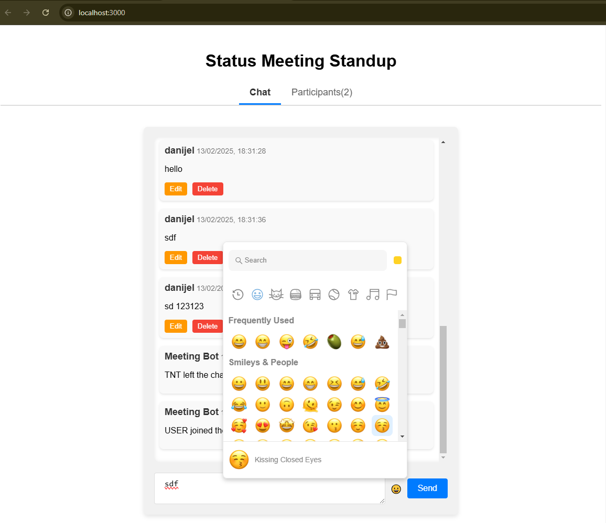

# Chat Service Application

This is a simple chat service built with TypeScript, `socket.io-client`, `ws` (for WebSocket communication), and `emoji-picker-react`. The chat application allows users to communicate in real-time, supporting the following features:

- Multi-device support (at least two devices connected simultaneously)
- Display of active participants in the session
- Ability to edit and delete your own messages
- Other participants will see the updated and deleted messages in real-time
- Emojis integration in the chat
- URL links are clickable and show a preview when hovered

## Features Implemented
- **Multiple Devices Support:** The chat service works across multiple devices, allowing users to communicate in real-time, no matter the device they're on.
- **Active Participants List:** A list of active participants is displayed, showing who is currently in the session.
- **Message Editing:** Users can edit their own messages. Once edited, the change is reflected for all participants in real-time.
- **Message Deletion:** Users can delete their own messages. The message text will be removed, and a "message deleted" event will be shown to all participants.
- **Emoji Picker:** Integrated emoji picker for quick and easy emoji insertion.
- **URL Preview:** When a link is included in a message, it becomes clickable and shows a preview (title, description, and image) on hover.

## Technologies Used
- **Frontend:**
  - TypeScript
  - `socket.io-client` for real-time communication with the backend
  - `emoji-picker-react` for the emoji picker feature
  - React
- **Backend:**
  - TypeScript
  - `ws` (WebSocket) for real-time communication
  - Express for handling HTTP requests

## Getting Started

### Prerequisites
- Node.js installed (v12+ recommended)
- npm (Node Package Manager) or Yarn

### Installation

1. Clone the repository:
   ```bash
   git clone https://github.com/dmark1029/websocket-free-chat-test
   cd websocket-free-chat-test

2. Install dependencies for both Frontend and Backend
   ```bash
   cd chat-client
   npm install

   ```bash
   cd chat-server
   npm install

3. Build both Frontend and Backend
   ```bash
   cd chat-client
   npm run build

   ```bash
   cd chat-server
   npm run build
4. Modifying the Server IP Address

  After building the project, you need to update the WebSocket server IP address in the frontend to match the actual server IP address where your backend is running.

  Follow these steps:

  **Navigate to the `socket.ts` file**:
    - The file is located in `chat-client/src/utils/socket.ts`.

  **Update the WebSocket URL**:
    - Find the line where the WebSocket is initialized:
      ```typescript
      this.socket = new WebSocket("ws://localhost:5000");
      ```
    - Replace `"localhost"` with the actual IP address of your server. For example:
      ```typescript
      this.socket = new WebSocket("ws://172.16.19.37:5000");
      ```
    - Make sure to use the correct IP address of your server where the backend is hosted, and ensure the port number (`5000` in this case) matches the one used by your backend server.

  **Save the changes**:
    - After updating the IP address, save the file.

  Now, your frontend will connect to the correct backend server.

  ### Example

  If the server's IP address is `172.16.19.37`, the WebSocket URL in `socket.ts` should look like this:

  ```typescript
  this.socket = new WebSocket("ws://172.16.19.37:5000");
  ```
5. Running the Application
   ```bash
   cd chat-client
   npm run start

   ```bash
   cd chat-server
   npm run start

Let me attach the images of the running application below




